# CIFAR10-VGG16

An implementation of VGG-16 model for classifing the CIFAR-10 dataset with PyTorch. It can achieve 93.54% accuracy on the validation set and 92.45% accuracy on the test set after training for 80 epochs.  
I'm using `PyTorch 2.10.0+cu128` in `Python 3.12.0`.

## Structure
```
├── cifar10-vgg16/
├── data/
|   ├── raw/
|   |   ├── train
|   |   └── test
|   ├── processed/
|   |   ├── train
|   |   ├── val
|   |   └── test
├── models/
|   ├── best_model.pth
|   ├── latest_checkpoint.pth
|   ├── history.pkl
|   └── ...
├── config.py
├── utils.py
├── prepare_data.py
├── dataset.py
├── model.py
├── train.py
├── predict.py
└── eval.py
```

## Requirements
```
matplotlib==3.10.8
numpy==2.4.3
Pillow==12.1.1
torch==2.10.0+cu128
torchvision==0.25.0+cu128
tqdm==4.67.3
```

## Dataset
The dataset comes from Kaggle website: [CIFAR-10](https://www.kaggle.com/datasets/oxcdcd/cifar10). The raw training set has 50,000 images, the raw test set has 10,000 images. Each image is a 32 x 32 RGB image.    
Unlike the previous binary classification problem [Dogs vs. Cats](https://github.com/LCZ-ctrl/Dogs-vs-Cats), this is a classification problem with 10 categories. The 10 labels are: airplane, automobile, bird, cat, deer, dog, frog, horse, ship, truck  
<br>
<p align="center">
  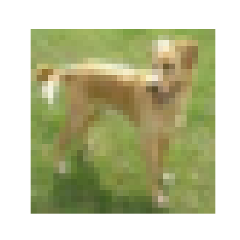
  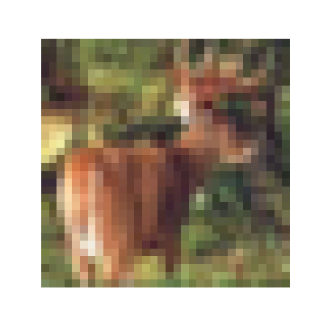
  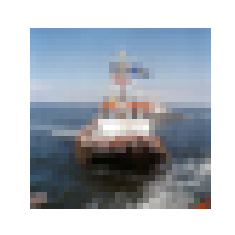
  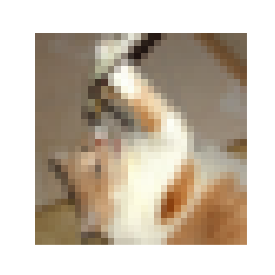
  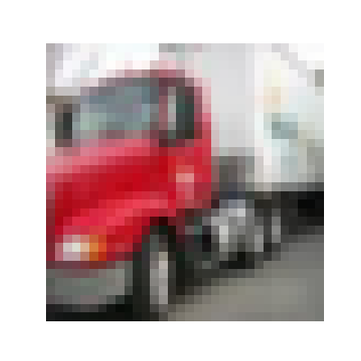
  <br>
  <em><strong>CIFAR-10 Dataset</strong></em>
</p>

## Data Preparation & Augmentation
#### <em>Splitting</em>:  
To split the data, run the command -
```
python prepare_data.py
```
This will split the raw training data into 90% Training (45,000) and 10% Validation (5,000).
#### <em>Augmentation</em>:  
I placed data augmentation in ```dataset.py```
```
data_transforms = {
    'train': transforms.Compose([
        transforms.RandomCrop(32, padding=4),
        transforms.RandomHorizontalFlip(p=0.5),
        transforms.RandomRotation(degrees=10),
        transforms.ColorJitter(brightness=0.3, contrast=0.3, saturation=0.2, hue=0.03),
        transforms.ToTensor(),
        transforms.Normalize(mean=[0.4914, 0.4822, 0.4465], std=[0.2023, 0.1994, 0.2010]),
        transforms.RandomErasing(p=0.2, scale=(0.02, 0.1), ratio=(0.3, 3.3), value=0)
    ]),
    'val': transforms.Compose([
        transforms.ToTensor(),
        transforms.Normalize(mean=[0.4914, 0.4822, 0.4465], std=[0.2023, 0.1994, 0.2010])
    ])
}
```
```transforms.RandomCrop(32, padding=4)```: Pads image by 4 pixels then crops back to 32 x 32.  
```transforms.RandomHorizontalFlip(p=0.5)```: 50% chance of flipping the image horizontally.  
```transforms.RandomRotation(degrees=10)```: Rotate the image randomly between -10° and +10°.  
```transforms.ColorJitter(brightness=0.3, contrast=0.3, saturation=0.2, hue=0.03)```: Color fluctuation.  
```transforms.RandomErasing(p=0.2, scale=(0.02, 0.1), ratio=(0.3, 3.3), value=0)```: 20% probability of erasing areas in the image.  

## Model Arichetecture
The VGG-16 model is a convolutional neural network (CNN) architecture that was proposed by the Visual Geometry Group (VGG) at the University of Oxford. It is characterized by its depth, consisting of 16 layers including 13 convolutional layers and 3 fully connected layers. VGG-16 is renowned for its simplicity and effectiveness as well as its ability to achieve strong performance on various computer vision tasks including image classification and object recognition. Despite its simplicity compared to more recent architectures it remains a popular choice for many deep learning applications due to its versatility and excellent performance.  
<br>
<p align="center">
  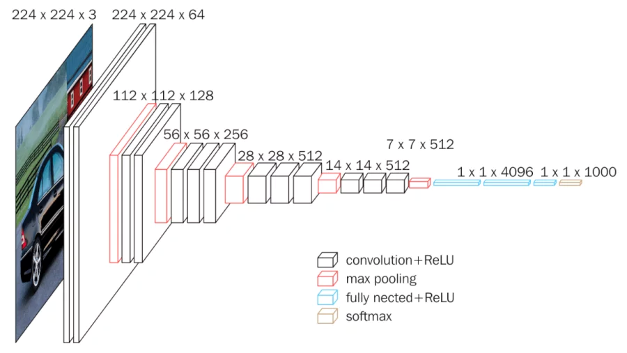
  <br>
  <em><strong>VGG-16 Model</strong></em>
</p>

It typically consists of 16 layers, including 13 convolutional layers and 3 fully connected layers. These layers are organized into blocks, with each block containing multiple convolutional layers followed by a max-pooling layer for downsampling.  
<br>
<p align="center">
  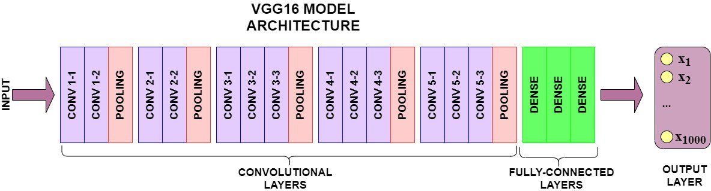
  <br>
  <em><strong>VGG-16 Architecture</strong></em>
</p>

I made a few minor modifications to the original model to adapt to the CIFAR-10 dataset:  
- The input images of CIFAR-10 are 32 x 32, after 5 pooling operations, the feature map size is reduced to 1 x 1 x 512.  
- I adjusted the fully connected layers to 512 -> 256 -> 256 -> 10. This significantly reduced the number of parameters. Using the original 4096 nodes would likely have resulted in overfitting on a small dataset like CIFAR-10.  
- Besides, I added Batch Normalization. Batch Normalization (BN) is a technique that accelerates the training of deep neural networks. By normalizing the input of each layer, it stabilizes the data distribution, improves training speed and model generalization ability.  

## Train
To start training, run the command - 
```
python train.py
```
I used a Cosine Annealing Schedule to adjust the learning rate during training - 
```
scheduler = CosineAnnealingLR(optimizer, T_max=NUM_EPOCHS, eta_min=1e-6)
```
- **T_max**: Number of iterations for the learning rate to decrease to eta_min.  
- **eta_min**: The minimum target learning rate.

The learning rate $\eta_t$ is adjusted according to the following formula:

$$
\eta_t = \eta_{min} + \frac{1}{2}(\eta_{max} - \eta_{min})\left(1 + \cos\left(\frac{T_{cur}}{T_{max}}\pi\right)\right)
$$

This strategy ensures a smooth transition from the initial learning rate to the minimum.  
The file saves the latest model after each epoch as ```latest_checkpoint.pth``` to support resuming training after an interruption. Additionally, it saves the best model based on the validation loss as ```best_model.pth```. Furthermore, the file saves a checkpoint every 10 epochs.

## Test
To test your trained model, run the command -
```
python predict.py
```
It randomly selects an image from the test set, and displays the image with its label and the model's predicition results (green for correct, red for wrong).

<br>
<p align="center">
  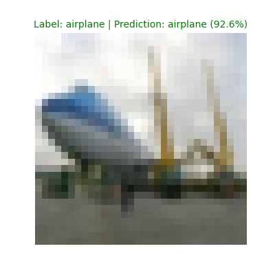
  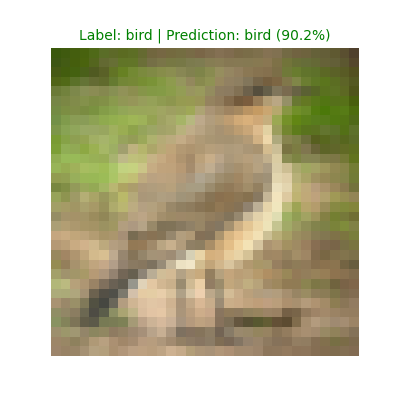
  <br>
  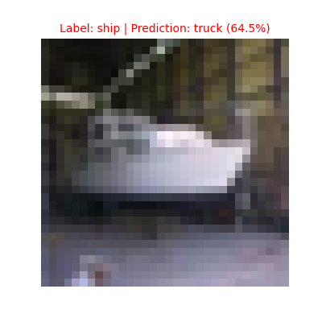
  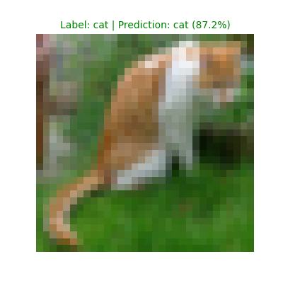
</p>

## Evaluation
To evaluate your trained model on the test set, run the command - 
```
python eval.py
```
It will show the model's prediction accuracy on the test set.

## Loss Curve
After training for 80 epochs, the VGG-16 model could achieve 93.54% accuracy on the validation set and 92.45% accuracy on the test set.

<br>
<p align="center">
  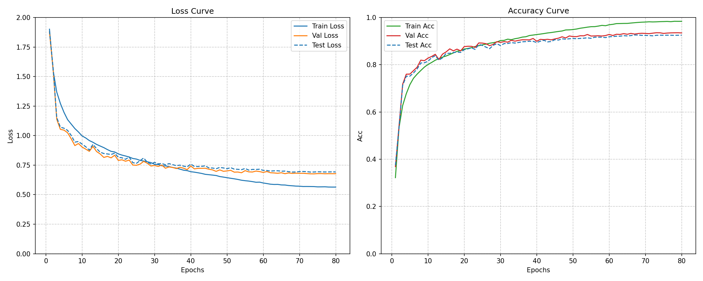
  <br>
  <em><strong>Loss Curve</strong></em>
</p>
<br><br>

<em><strong>My pre-trained model:</strong></em> [model](https://drive.google.com/file/d/1ZfnKQ4ecPfIdLZjyHnjD5e7vP_aQ19U3/view?usp=drive_link)
